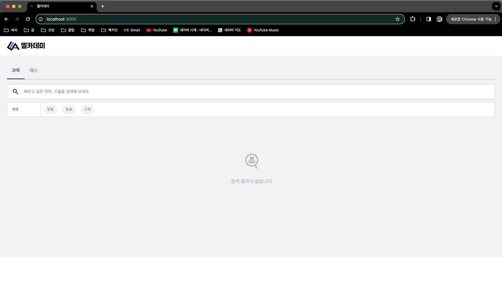

# 엘리스 프론트엔드 Programming Assesement

## Course Search

- 엘리스 기능 중 하나인 과목 검색의 간소화된 버전 구현

---

### 개발 환경

- React
- Typescript
- styled-components
- Jotai
- Axios
- ESLint, Prettier
- React-Test-Library
- react-error-boundary

---

### 프로젝트 구조

```text
📦src
┣ 📂__tests__
┃ ┗ 📜Search.test.tsx
┣ 📂components
┃ ┣ 📂common
┃ ┃ ┣ 📜ErrorComponent.jsx
┃ ┃ ┣ 📜FooterComponent.tsx
┃ ┃ ┣ 📜HeaderComponent.tsx
┃ ┃ ┗ 📜NoResultComponent.tsx
┃ ┣ 📂list
┃ ┃ ┣ 📜ListCardComponent.tsx
┃ ┃ ┗ 📜PaginationComponent.tsx
┃ ┗ 📂search
┃ ┃ ┣ 📜FilterComponent.tsx
┃ ┃ ┗ 📜SearchInputComponent.tsx
┣ 📂container
┃ ┣ 📜FilterContainer.tsx
┃ ┣ 📜ListContainer.tsx
┃ ┗ 📜SearchContainer.tsx
┣ 📂hooks
┃ ┗ 📜useDebounce.tsx
┣ 📂jotai
┃ ┗ 📜course.ts
┣ 📂pages
┃ ┗ 📜CoursePage.tsx
┣ 📂services
┃ ┣ 📜ListService.ts
┃ ┗ 📜api.ts
┣ 📂styles
┃ ┣ 📂common
┃ ┃ ┣ 📜footer.style.ts
┃ ┃ ┣ 📜header.style.ts
┃ ┃ ┗ 📜noresult.style.ts
┃ ┣ 📂list
┃ ┃ ┣ 📜list.style.ts
┃ ┃ ┗ 📜pagination.style.ts
┃ ┣ 📂search
┃ ┃ ┣ 📜filter.style.ts
┃ ┃ ┗ 📜search.style.ts
┃ ┗ 📜global.style.ts
┣ 📂types
┃ ┣ 📂components
┃ ┃ ┣ 📜filter.types.ts
┃ ┃ ┗ 📜list.types.ts
┃ ┗ 📂data
┃ ┃ ┣ 📜courseData.types.ts
┃ ┃ ┗ 📜filterData.types.ts
┗ 📜index.tsx
```

- **pages** : 라우팅 페이지를 기반으로 나눈 페이지 컴포넌트
- **container** : 동작 메서드들을 포함한 데이터 로직 생성 및 데이터 가공, 상태 데이터 관리하는 레이아웃 컴포넌트
- **components** : 실제 출력될 UI를 담은 컴포넌트
- **services** : API 요청 로직 및 인스턴스 로직 서비스 파일
- **jotai** : 전역 상태 선언 파일
- **styles** : styled-components 컴포넌트 파일
- **types** : 데이터 타입 및 인터페이스 명시 파일

---

### 기능 구현

- **Filter**
  - 요구사항대로 무료, 유료, 구독 세 가지의 필터 버튼 구현 및 관리
  - URL Query의 활용으로 새로 고침 시에도 선택된 필터 정보 남아있을 수 있도록 구현
  - 선택 여부 및 필터의 정보를 전역 상태로 관리, 상태 변화 감지 시 URL Query 수정
  - 새로 고침 시에도 필터 상태를 유지하기 위해 마운트 시 URL Query 검사 및 필터 상태 반영
  - 검색창엔 Debouncing 적용하여 키워드 데이터를 관리, API의 불필요한 호출 최소화
- **Pagination**
  - Course 리스트 데이터 패칭 시 리스트 개수 데이터를 활용해 5개 길이의 페이지 리스트 생성
  - 현재 페이지를 활용해 현재 페이지가 3페이지 이상이거나 현재 페이지가 마지막 페이지로부터 2페이지 이내가 아닌 경우 리스트의 중앙값에 현재 페이지가 위치하도록 구현
  - 나머지 경우엔 처음 및 마지막 페이지까지 보이도록 구현
  - 이전, 다음 버튼 구현 및 이전, 다음으로 이동 불가능 시 비활성화 구현
  - offset 데이터를 전역 상태로 관리하며 페이지 변경을 감지해 변경된 offset으로 리스트 데이터 호출
  - 리스트 데이터 호출 시 현재 페이지 데이터 유효성 검사 및 초기화
    - **ex).** 현재 3페이지에서 필터 및 검색어를 변경했을때 리턴된 데이터 리스트의 개수가 없거나 1페이지 분량일 경우 현재 페이지 offset 초기화가 필요하기에
- **State Management**
  - 현재 페이지(offset), Course 리스트 데이터, Filter 데이터 세 가지를 전역 상태로 관리
  - 전역 상태 관리는 Atom패턴의 `Jotai` 라이브러리를 활용.
  - 프로젝트의 규모나 전역 상태의 개수 및 사용이 많지 않을 것으로 생각해 비교적 보일러 플레이트가 적은 라이브러리 선정
- **API**
  - 엔드포인트는 환경변수 처리하여 따로 관리
  - Axios 라이브러리를 사용해 비동기 호출
  - instance 파일에서 인스턴스를 생성해 코드 가독성 향상 및 URL 코딩과 서비스 로직 분리
  - isAxiosError 메서드를 활용해 에러 분기처리
  - 검색 결과 없을 시 분기 처리 하여 검색 결과 없음을 알리는 컴포넌트 출력

---

### 개발 화면

- **페이지네이션 동작 화면**


- **필터 및 검색어 동작 화면**



---

### 기타

- **스타일**
  - 주어진 요구사항과 최대한 알맞은 스타일 구현
  - 필터 버튼 및 카드뷰, 페이지네이션 버튼에 호버 이펙트 구현
  - 필터 및 페이지네이션 버튼 선택 상태에 따른 스타일 분기 처리
  - 각 과목의 가격(무료, 유료, 할인 여부) 상태에 따른 스타일 분기 처리
  - 과목 리스트 레이아웃을 flex-wrap과 min-width를 활용해 화면 크기에 따라 2, 3, 4개로 정렬 출력
  - 과목 썸네일 이미지 여부(과목 이미지, 로고 이미지)에 따라 이미지 출력 분기 처리
  - 검색창 포커스 상태 관리로 포커스 시 아웃라인 색상 변경 구현
  - 페이지네이션 이전, 다음 버튼의 비활성화 상태에 따른 스타일 분기 처리
- **접근성**
  - 웹 접근성 향상을 위해 용도에 맞는 HTML 태그 사용 지양
  - 메타데이터 및 favicon을 엘리스와 비슷하게 맞추어 접근성 향상하려 노력
- **최적화**
  - 여러 상태들의 변화로 인해 메서드가 재생성되지 않도록 useCallback을 활용해 재생성이 필요한 상태 변화가 있을때만 바뀔 수 있도록 구현
  - useEffect의 의존성 배열을 활용해 메서드 호출이 필요한 상태가 변화되었을 때만 호출될 수 있도록 구현해 렌더링 최적화를 노력
  - useDebounce 훅을 지연시간 0.5s로 걸어 제작해 검색어가 입력될 때마다 API가 호출되지 않도록 해 무분별한 API 호출 막으려 노력
- **에러 처리**
  - react-error-boundary를 활용해 에러 발생 시 ErrorComponent로 Fallback 되도록 구현
  - 에러 상태에 따른 이미지 출력으로 사용자에게 현재 에러 상태에 관한 정보 간략히 출력
  - API 비동기 호출 간 에러 발생 시 서버 에러라는 에러 객체를 발생시킴
  - 검색 결과 없을때도 NoResultComponent를 출력하도록 처리
  - 페이지 이동 후 새로 검색을 요청했을 때 현재 페이지가 첫 페이지가 아니라면 현재 페이지 상태를 초기화 할 수 있도록 구현
